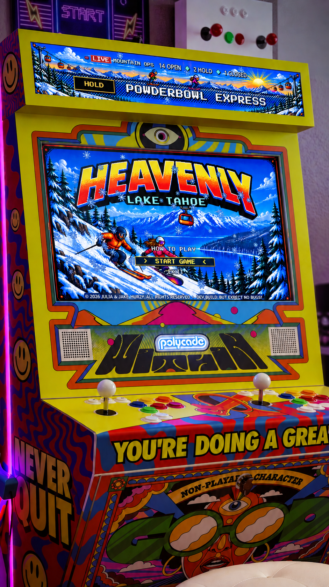

# Gunbarrel Haus

Gunbarrel Haus is a side-view, 2.5D terrain-park skiing game for the Polycade Sente arcade cabinet. Pick a route down the slope, manage speed, time the pop at the lip, perform a trick, and land cleanly for the best score.

<table>
  <tr>
    <td width="320" valign="top">
      
    </td>
    <td valign="top">
      <h2>Polycade Sente Compatibility</h2>
      <p>The game targets the Polycade Sente's two-display arcade setup.</p>
      <table>
        <thead>
          <tr><th>Display</th><th>Design resolution</th><th>Purpose</th></tr>
        </thead>
        <tbody>
          <tr><td>Primary</td><td>1920x1080</td><td>Attract mode, player selection, instructions, and gameplay</td></tr>
          <tr><td>Digital marquee</td><td>1920x360</td><td>Always-on mountain-operations ticker and animated skier/snowboarder display</td></tr>
        </tbody>
      </table>
      <p>The Sente uses Polycade Neo-Arcade Controller Boards in XInput mode. The game maps the cabinet's digital eight-way joystick and action controls to standard XInput inputs, with keyboard equivalents for development.</p>
      <table>
        <thead>
          <tr><th>Game action</th><th>Sente control</th><th>Keyboard</th></tr>
        </thead>
        <tbody>
          <tr><td>Move / carve / rotate</td><td>Joystick</td><td><code>W</code>, <code>A</code>, <code>S</code>, <code>D</code></td></tr>
          <tr><td>Tuck / grab</td><td>A</td><td><code>J</code></td></tr>
          <tr><td>Brake / release</td><td>B</td><td><code>K</code> or <code>B</code></td></tr>
          <tr><td>Compress / pop / tweak</td><td>X</td><td><code>L</code></td></tr>
          <tr><td>Sharp carve</td><td>Y</td><td><code>I</code></td></tr>
          <tr><td>Exit to AGS</td><td>Hold EXIT, or Start + Select</td><td><code>Esc</code> opens the in-game exit flow</td></tr>
        </tbody>
      </table>
    </td>
  </tr>
</table>

The cabinet panel provides matching control sets for Players 1 and 2. See [POLYCADE_SENTE_CONTROLS.md](POLYCADE_SENTE_CONTROLS.md) for the complete panel and XInput mapping.

On a cabinet with two displays, the primary window opens on the main display and the marquee opens on the other display. On a single display, The game runs primary-only unless marquee development overrides are enabled.

### Polycade AGS

Polycade AGS is the cabinet's game-selection and launch environment. It discovers locally installed games, presents their artwork in the cabinet interface, launches the selected executable, and returns to the game selector when the game exits.

The game is designed to run inside AGS as a DRM-free Windows game. The packaged installer places the executable and its `.pck` data in AGS's `games/drm-free/HEAVENLY` directory, and places the library tile, hero, logo, marquee, and instructions artwork in AGS's matching `assets/drm-free/HEAVENLY` directory. This keeps the game, its cabinet presentation, and its two-display behavior integrated with the Sente.

AGS is the cabinet distribution target, not a runtime requirement. The exported Windows build is also a standalone executable that can run outside AGS. Without a second detected display it uses the primary game window; use `just sente` during development to preview both windows on one desktop.

## Marquee And Live Lift Status

The digital marquee is a dedicated 1920x360 Godot window. It shows an animated skier and snowboarder, a scrolling lift-status ticker, an operations footer, snowfall, and a `LIVE MOUNTAIN OPS` treatment designed for the Sente's overhead display.

The game includes a Liftie client for live Heavenly Mountain Resort lift information from [liftie.info](https://liftie.info). It requests `https://liftie.info/api/resort/heavenly` at launch and every 60 seconds, then normalizes open, hold, closed, and scheduled lift counts.

Copy [heavenly.cfg.example](heavenly.cfg.example) to `heavenly.cfg` in the repository for development. The packaged game receives this configuration next to `HEAVENLY.exe`; the installer preserves existing live configuration on updates.

The Liftie service is initialized and passed to both display views. At present, the marquee's visible lift names and statuses are demo content, so live Liftie responses are not yet rendered in its ticker. The API polling and configuration are in place for that connection; when it is wired in, the marquee will refresh from Liftie's Heavenly data once per minute. Liftie data is informational only; observe all posted resort signage and operations guidance.

## Development

### Prerequisites

- Godot `4.6.3` (the pinned version is in [`.godot-version`](.godot-version))
- [just](https://github.com/casey/just)
- `gdtoolkit` 4.x for formatting and linting
- `pre-commit` and `actionlint` for the full check suite

On macOS, install the development dependencies with:

```sh
just install
```

Set `GODOT_BIN` if Godot is not installed at the default Homebrew cask path. Verify the selected editor version with:

```sh
just version
```

### Build Targets

| Command | Purpose |
| --- | --- |
| `just dev` | Open the project in the Godot editor. |
| `just run` | Run locally with the normal display behavior. |
| `just sente` | Run primary and marquee development windows at their Sente design resolutions on one display. |
| `just sente-low` | Run the Sente window check at 30 FPS. |
| `just sente-target` | Run the Sente window check at 60 FPS. |
| `just sente-high` | Run the Sente window check at 120 FPS. |
| `just import` | Import resources headlessly, as performed before export. |
| `just test` | Run the headless park-rider simulation tests. |
| `just check` | Run formatting, linting, type checks, simulation tests, and workflow linting. |
| `just export` | Create a local 64-bit Windows build at `build/HEAVENLY/HEAVENLY.exe`. |
| `just package` | Export, assemble the AGS payload, and create `HEAVENLY-windows-x86_64.zip` with a SHA-256 checksum. |

The canonical cabinet package is the Windows x86_64 export. `just package` includes the game, `Install.ps1`, and Polycade artwork in the release archive. For cabinet installation and AGS directory requirements, see [WINDOWS-INSTALL.md](WINDOWS-INSTALL.md).

### Standalone And Web Builds

Godot can export the game as a standalone native application in addition to the AGS package. This repository currently defines and automates the 64-bit Windows desktop preset, which produces a standalone `HEAVENLY.exe` before it is assembled into the AGS installer payload.

Godot can also export the game for the web. A Web preset produces an HTML/JavaScript loader with the Godot runtime compiled to WebAssembly (Wasm), allowing the game to be hosted on a web server and run in a compatible browser. A Web export preset and a `just` target are not yet checked into this repository, so this is a supported engine path rather than a maintained release target. A web deployment must also account for browser networking rules for the Liftie request, and, if threaded Web exports are enabled, serve the required cross-origin isolation headers.
