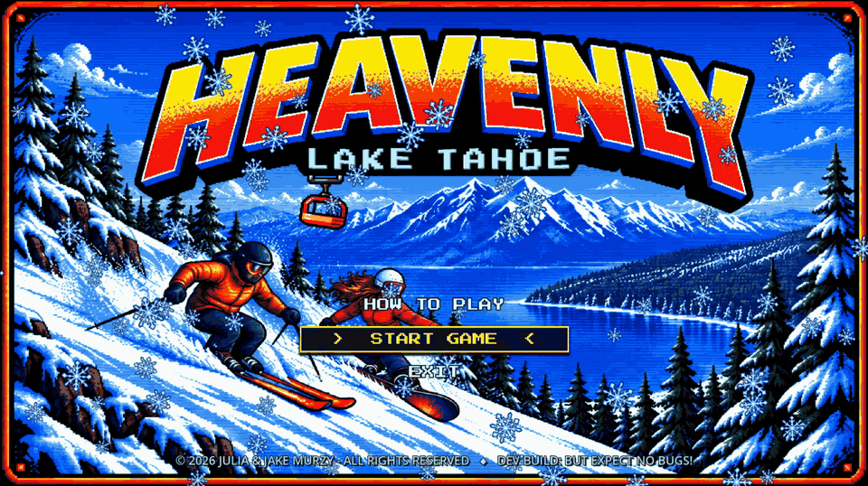
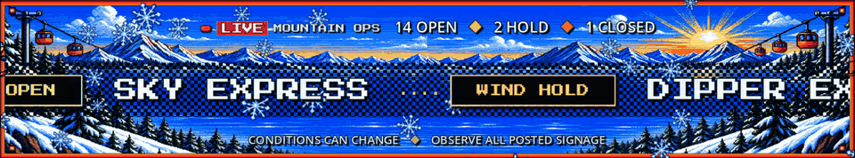
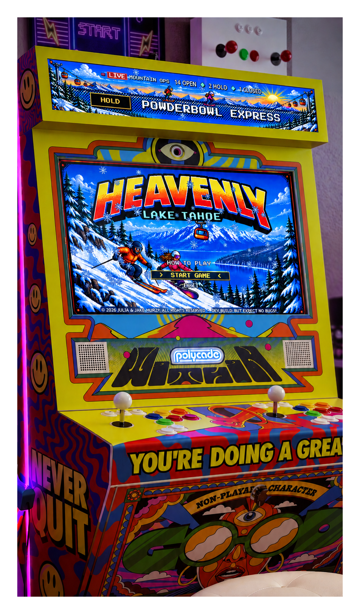

# Groove Park at Heavenly [](https://github.com/jmurzy/groove-park/actions/workflows/windows-build.yml) [](https://github.com/jmurzy/groove-park/actions/workflows/api-deploy.yml) [](LICENSE)

Groove Park is a '90s-style retro arcade, side-view 2.5D terrain-park skiing game for the Polycade Sente arcade cabinet. Pick a route down the slope, manage speed, time the pop at the lip, perform a trick, and land cleanly for the best score.



## Marquee And Live Lift Status



The digital marquee is a dedicated 1920x360 Godot window. It shows an animated skier and snowboarder, a scrolling lift-status ticker, an operations footer, snowfall, and a `LIVE MOUNTAIN OPS` treatment designed for the Sente's overhead display.

The game includes a Liftie client for live Heavenly Mountain Resort lift information from [liftie.info](https://liftie.info). It requests `https://liftie.info/api/resort/heavenly` at launch and every 60 seconds, then normalizes open, hold, closed, and scheduled lift counts.

Copy [heavenly.cfg.example](heavenly.cfg.example) to `heavenly.cfg` in the repository for development. The packaged game receives this configuration next to `HEAVENLY.exe`; the installer preserves existing live configuration on updates.

The `leaderboard_api.base_url` and `liftie_api.user_agent` settings are required. The game exits at startup when either is missing or blank. The Liftie service is initialized and passed to both display views. At present, the marquee's visible lift names and statuses are demo content, so live Liftie responses are not yet rendered in its ticker. The API polling and configuration are in place for that connection; when it is wired in, the marquee will refresh from Liftie's Heavenly data once per minute. Liftie data is informational only; observe all posted resort signage and operations guidance.

## Polycade AGS



Polycade AGS is the cabinet's game-selection and launch environment. It discovers locally installed games, presents their artwork in the cabinet interface, launches the selected executable, and returns to the game selector when the game exits.

The game is designed to run inside AGS as a DRM-free Windows game. The packaged installer places the executable and its `.pck` data in AGS's `games/drm-free/HEAVENLY` directory, and places the header, hero, and marquee artwork in AGS's matching `assets/drm-free/HEAVENLY` directory. This keeps the game, its cabinet presentation, and its two-display behavior integrated with the Sente.

AGS is the cabinet distribution target, not a runtime requirement. The exported Windows build is also a standalone executable that can run outside AGS. Without a second detected display it uses the primary game window; use `just sente` during development to preview both windows on one desktop.

<br clear="left" />

### Polycade Sente Compatibility

The game targets the Polycade Sente's two-display arcade setup.

| Display | Design resolution | Purpose |
| --- | --- | --- |
| Primary | 1920x1080 | Attract mode and gameplay |
| Marquee | 1920x360 | Always-on mountain-operations ticker |

The Sente uses Polycade Neo-Arcade Controller Boards in XInput mode. The game maps the cabinet's digital eight-way joystick and action controls to standard XInput inputs, with keyboard equivalents for development.

The cabinet panel provides two matching control stations. HEAVENLY is a solo game: either station supplies input for the active rider. See [POLYCADE_SENTE_CONTROLS.md](POLYCADE_SENTE_CONTROLS.md) for the complete panel and XInput mapping.

On a cabinet with two displays, the primary window opens on the main display and the marquee opens on the other display. On a single display, The game runs primary-only unless marquee development overrides are enabled.

## Terrain editor

Run `just run -- --designer-mode` to view the debug course overlay in a debug
build.

### Course profile

Open `src/game/park/park_course_editor.tscn` in the Godot editor to shape the
approach and landing paths over the gameplay panorama. Select one of the named
approach or landing path nodes in the Scene tree and use Godot's native Path2D
controls in the 2D viewport to add, move, or remove points. Save the scene to
write every route to `park_course.tres`. Use **Preview Color** and **Preview
Width** in the path's Inspector to set its high-contrast guide line.

## Development

### Prerequisites

- Godot `4.6.3` (the pinned version is in [`.godot-version`](.godot-version))
- [just](https://github.com/casey/just)
- `gdtoolkit` 4.x for formatting and linting
- `pre-commit` and `actionlint` for the full check suite

On macOS, install the development dependencies with:

```sh
just install
```

Set `GODOT_BIN` if Godot is not installed at the default Homebrew cask path. Verify the selected editor version with:

```sh
just version
```

### Build Targets

| Command | Purpose |
| --- | --- |
| `just dev` | Open the project in the Godot editor. |
| `just run` | Run locally with the normal display behavior. |
| `just sente` | Run primary and marquee development windows at their Sente design resolutions on one display. |
| `just sente-low` | Run the Sente window check at 30 FPS. |
| `just sente-target` | Run the Sente window check at 60 FPS. |
| `just sente-high` | Run the Sente window check at 120 FPS. |
| `just import` | Import resources headlessly, as performed before export. |
| `just test` | Run the headless park-rider simulation tests. |
| `just check` | Run formatting, linting, type checks, simulation tests, and workflow linting. |
| `just export-ags` | Create a local 64-bit Windows build at `build/ags/HEAVENLY.exe`. |
| `just export-web` | Create the Web/Wasm release at `build/web/index.html`. |
| `just package-ags` | Export, assemble the AGS payload, and create `HEAVENLY-windows-x86_64.zip` with a SHA-256 checksum. |

The canonical cabinet package is the Windows x86_64 export. `just package-ags` includes the game, `Install.ps1`, and Polycade artwork in the release archive. For cabinet installation and AGS directory requirements, see [WINDOWS-INSTALL.md](WINDOWS-INSTALL.md).

### Standalone And Web Builds

Godot can export the game as a standalone native application in addition to the AGS package. This repository currently defines and automates the 64-bit Windows desktop preset, which produces a standalone `HEAVENLY.exe` before it is assembled into the AGS installer payload.

`just export-web` produces a non-threaded Godot Web/Wasm build in `build/web`. GitHub Actions
uploads each release under its commit SHA in the `game-releases` R2 bucket. The game Worker serves a
no-cache entry document at `game.gunbarrelhaus.com`; its injected release-specific base URL sends
the Wasm, PCK, and JavaScript requests directly to R2's `assets.game.gunbarrelhaus.com` custom
domain. The browser owns resizing and fullscreen; the game keeps its 1920x1080 presentation
letterboxed, composes the cabinet marquee above the primary game view, and has no cabinet-exit
action.

Web is supported on desktop browsers with a keyboard or connected gamepad. Browser builds do not
read `heavenly.cfg` or send Liftie requests directly. They persist a browser-scoped installation ID
for leaderboard rate-limit grouping; other local browser settings remain browser-managed. The Web
export is non-threaded, so it does not require cross-origin isolation headers.
